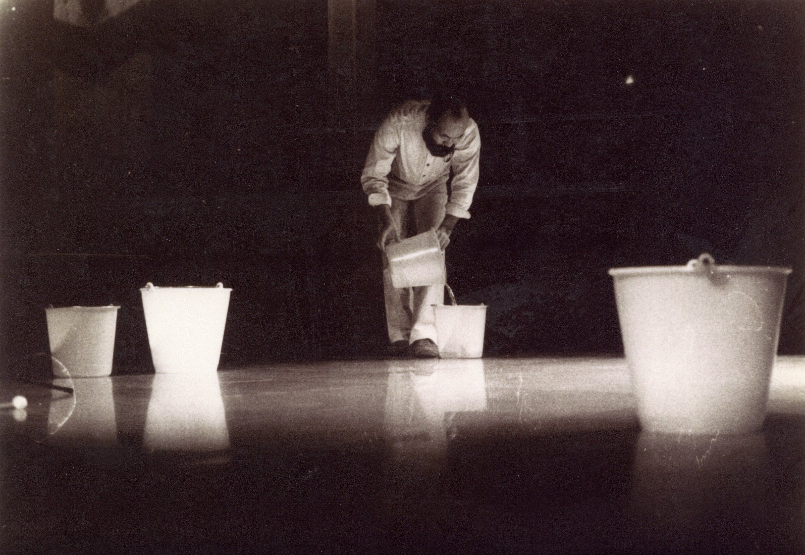

<i>Presented with Blank Forms</i>

To celebrate Blank Forms reissue of Takehisa Kosugi and Akio Suzuki’s 1980 record New Sense of Hearing, Blank Forms and Crossing Tones will present a listening session featuring unreleased recordings of Akio Suzuki made by producer, engineer, and label-runner Kazunori Sugiyama. In 2020, Sugiyama entrusted Crossing Tones with the stewardship of his meticulous archive of documentation gathered over the forty-three years he spent photographing and recording New York’s avant-garde music scene. In this listening session, we will play selected highlights from Sugiyama’s numerous live recordings of Suzuki in their original format. Sealed originals from Sugiyama’s first record label, Bellows, and books from his personal collection will be available for purchase.

<a class="button" href="https://www.blankforms.org/events/akio-suzuki-listening-session
">RSVP</a>

<caption>Akio Suzuki performing Conceptual Soundwork at the Festival d’Automne à Paris, 1978. Photo: Mami Aoyama.</caption>
<!-- <iframe src="https://giphy.com/embed/REPL2BIiGhyFO" width="480" height="270" frameBorder="0" class="giphy-embed" allowFullScreen></iframe> -->